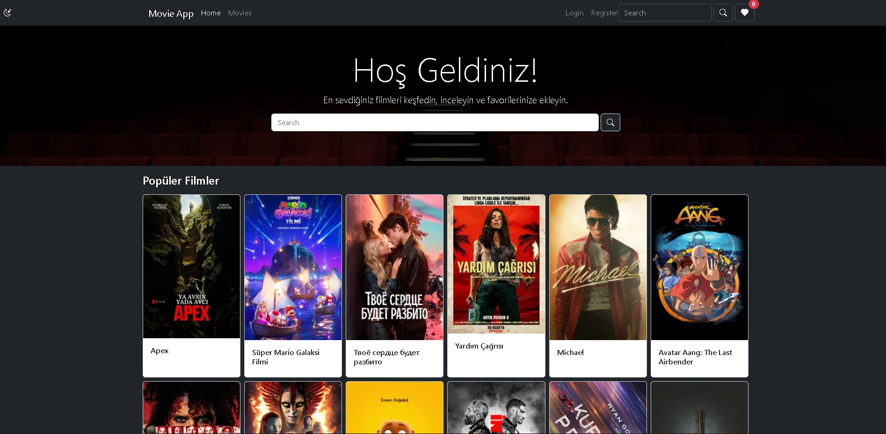
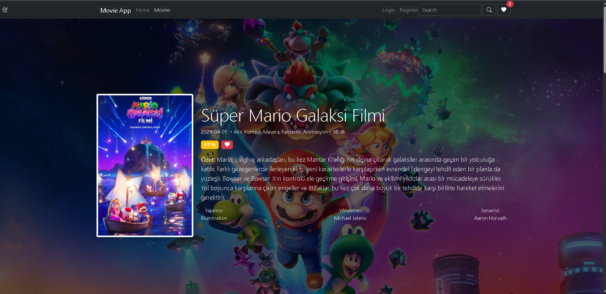
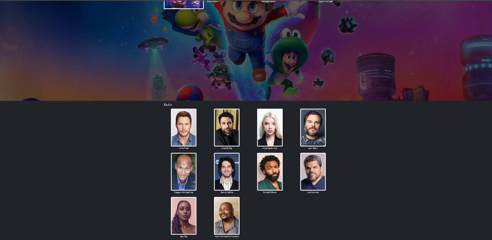
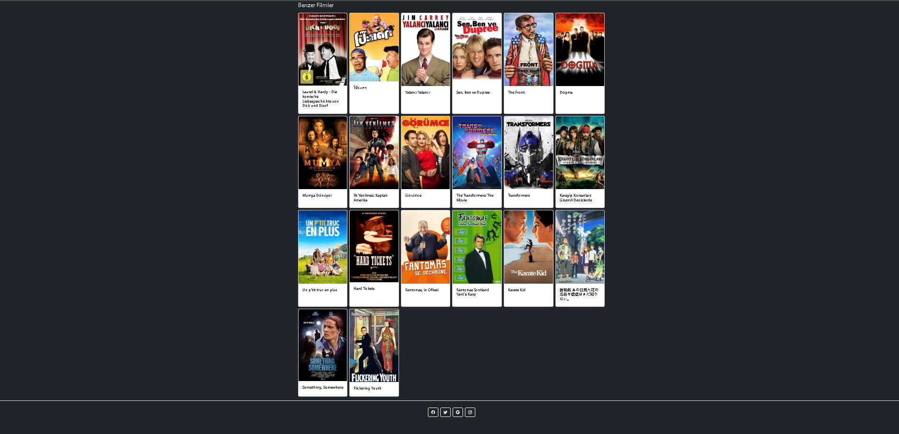
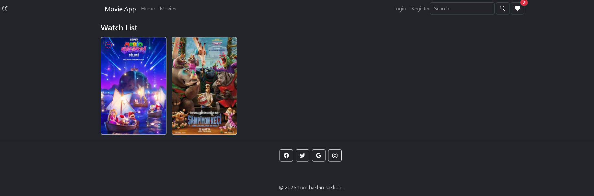
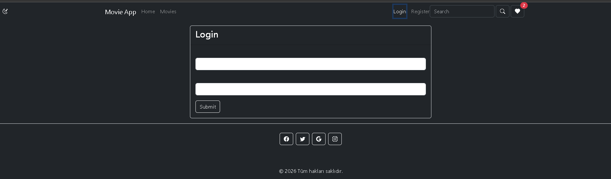
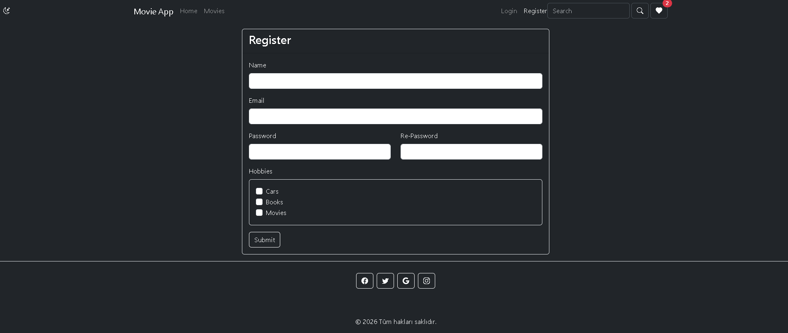
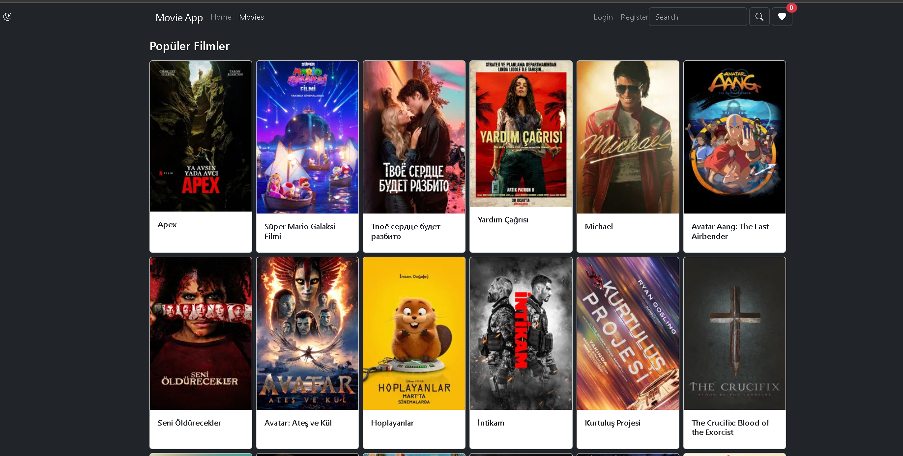

#  Movie App (React)


Modern React (Vite) kullanılarak geliştirilmiş bu uygulama, kullanıcıların filmleri keşfetmesini, detaylarını incelemesini ve favorilerine eklemesini sağlar.

---

##  Canlı Demo

 https://your-app.vercel.app

---

##  Özellikler

 - Dinamik Arama: TMDB veri tabanında anlık film arama.
 - Popüler & Benzer Filmler: Trend olan içerikleri keşfetme ve seçilen filme benzer önerileri görme.
 - Detaylı Analiz: Oyuncu kadrosu, türler, puanlama ve süre bilgilerini içeren kapsamlı detay sayfası.
 - Watchlist (İzleme Listesi): Context API ve LocalStorage ile desteklenen kişisel favori listesi.
 - Tema Desteği: Dark / Light mode geçiş özelliği.
 - Gelişmiş Formlar: Custom Hook (useInput) ile yönetilen, validasyonlu giriş ve kayıt ekranları.
 - Sayfalama (Pagination): Arama sonuçlarında akıcı gezinti.

---

##  Kullanılan Teknolojiler

- React (Hooks, Context API)
- React Router (v6)
- Vite
- Bootstrap & Bootstrap Icons
- TMDB API

---

##  Mimari Yaklaşım

Bu projede:

- Component bazlı mimari (UI ayrımı)
- Context API ile global state yönetimi (Theme & User)
- Custom hook (useInput) ile reusable form kontrolü
- React Router ile nested routing yapısı
- LocalStorage ile veri kalıcılığı (watchlist)

kullanılmıştır.

---

##  Proje Yapısı

```
src/
│
├── components/       # UI bileşenleri
├── contexts/         # Theme & User context
├── hooks/            # Custom hook (useInput)
├── layouts/          # Layout yapısı
├── pages/            # Sayfalar
├── utils/            # Validation fonksiyonları
│
├── App.jsx
├── main.jsx
```

---

##  Kurulum

Projeyi lokalde çalıştırmak için:

```bash
git clone https://github.com/USERNAME/movie-app.git
cd movie-app
npm install
npm run dev
```

---

##  Environment Variables

API anahtarı güvenliği için `.env` dosyası kullanılır.

Proje kök dizinine `.env` dosyası oluştur:

```
VITE_API_KEY=your_api_key_here
```

Kod içinde kullanım:

```js
const api_key = import.meta.env.VITE_TMDB_API_KEY;
```

---

##  API

Bu proje film verilerini **The Movie Database (TMDB)** API üzerinden çekmektedir.

---

##  Ekran Görüntüleri

###  Home


### Film Detayı


### Oyuncu Kadrosu


### Benzer Filmler 


### Watchlist


### Login


### Register


### Movies


---

##  Öğrenilen Konular

- Context API ile global state yönetimi
- Custom hook (useInput) geliştirme
- API entegrasyonu ve async veri yönetimi
- React Router ile dinamik routing
- Form validation ve hata yönetimi
- Conditional rendering

---

##  Geliştirilebilir Alanlar

-  Gerçek authentication sistemi
-  Debounce ile search optimizasyonu
-  React Query / SWR ile API caching
-  Skeleton loading UI
-  Lazy loading (code splitting)
-  Test (Jest / React Testing Library)

---


